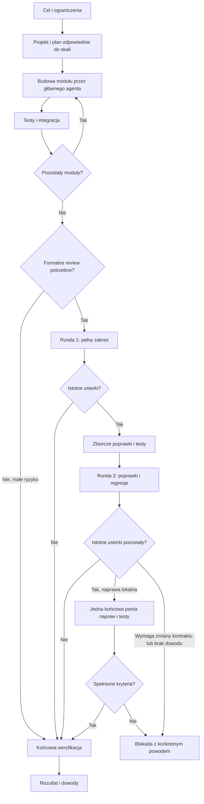

# Delta Rocket

## 1. Rekomendacja

Delta Rocket powinien być **samodzielnym skillem z małym plikiem głównym i kilkoma referencjami ładowanymi na żądanie**. Superpowers pozostaje inspiracją procesu: zrozumienie celu, projekt, plan, implementacja, weryfikacja i zakończenie. Wykonanie należy jednak opisać od nowa: główny agent buduje spójne moduły, a jeden reviewer ocenia cały zaakceptowany zakres w najwyżej dwóch rundach.

Ponytail wnosi zasadę ograniczania potrzebnego kodu, Caveman — ograniczania narracji. Nie należy ładować trzech pełnych systemów instrukcji jednocześnie. Taka kompozycja zachowałaby ich konflikty, koszty kontekstu i niepożądane mechanizmy aktywacji. Delta Rocket powinien przejąć wybrane reguły, z własnymi kryteriami wykonania i zakończenia.

**Najważniejsze ustalenia:**

- Aktualny Superpowers częściowo rozwiązał problem nadmiaru review: używa wspólnego review zgodności i jakości oraz zawęża ponowne przeglądy. Nadal jednak przewiduje do pięciu rund naprawczych **na zadanie**, oprócz przeglądu końcowego.[^1]
- `executing-plans` nie gwarantuje pracy głównego agenta: nakazuje przejście do `subagent-driven-development`, jeżeli subagenci są dostępni. To bezpośrednio koliduje z preferowanym wykonaniem inline.[^2]
- Oficjalne zalecenia dla Astry wspierają zmniejszanie nadmiernie szczegółowych instrukcji, wąskie opisy aktywacji i ładowanie dokumentów zależnie od potrzeby.[^3]
- Skrócenie tekstu w czacie nie jest pomiarem oszczędności całej sesji. Dla Delta Rocket potrzebny jest benchmark uwzględniający kontekst i wszystkich agentów.
- Limit dwóch rund jest wykonalny jako reguła procesu. **Skill instrukcyjny nie stanowi deterministycznego mechanizmu egzekwowania limitu.** Nie znaleziono ustawienia Codexa oznaczającego „maksymalnie dwa review dla tego zakresu”.

Rekomendacja dotyczy projektu v0.1. Nie jest wynikiem benchmarku gotowego Delta Rocket; taki skill jeszcze nie został zaimplementowany.

## 2. Zakres i podstawa źródłowa

Stan wiedzy: **13 września 2026 r.** Główne środowisko: Codex desktop na Windows, PowerShell, model głównego agenta GPT-6 Astra. Publiczna dokumentacja część dawnych adresów `developers.openai.com/codex/...` przekierowuje obecnie do `learn.chatgpt.com/docs/...`; poniższe źródła zachowują adresy docelowe.

Analiza repozytoriów została przypięta do konkretnych commitów. Data commita oznacza czas zapisany w jego metadanych, nie datę publikacji każdej reguły.

| Projekt | Przeanalizowany commit | Data commita UTC | Zakres |
|---|---|---|---|
| Superpowers | `b36e0829c6d0140e93cfef2ca599b1b07d4a7797` | 2026-08-12 | Skills, prompty wykonawców i reviewerów, hooki, licencja |
| Ponytail | `356918eba965ee1eac64bd3a7f0dd02108350de5` | 2026-09-07 | Główny skill, review, benchmark, hooki, licencja |
| Caveman | `15581d14007fd01fb3f132016741962f34936ca2` | 2026-09-07 | Skill komunikacji, README, dokument pomiarowy, podział licencji |
| Codex CLI | `25af12f7e61572b0bc18ddb1008be543b91519b0`, tag `rust-v0.145.0` | 2026-07-21 | Schemat konfiguracji, spawn V2, zdarzenia i liczniki JSONL |

Lokalne `codex --version` zwróciło `codex-cli 0.145.0`. Porównanie SHA-256 czterech lokalnych plików Superpowers — `brainstorming`, `writing-plans`, `executing-plans`, `subagent-driven-development` — wykazało identyczność z powyższym snapshotem upstream. To obserwacja tej instalacji, nie twierdzenie o wersjach wszystkich pluginów. Wersja CLI znaleziona w PATH nie dowodzi wersji backendu aplikacji desktop.

W raporcie „potwierdzone” oznacza informację z odczytanej dokumentacji, kodu lub wskazanej obserwacji lokalnej. „Rekomendacja” oznacza decyzję projektową proponowaną dla Delta Rocket. Deklaracje benchmarków autorów nie są traktowane jako niezależna walidacja skuteczności.

## 3. Codex i GPT-6 Astra

### 3.1. Model i poziomy rozumowania

Oficjalna nazwa to **GPT-6 Astra**, identyfikator API: `gpt-6-astra`. Karta API podaje poziomy `low`, `medium`, `high`, `xhigh`, `max`, okno kontekstu 1 050 000 tokenów i limit wyjścia 128 000 tokenów. Są to parametry API, a nie gwarancja ilości kontekstu udostępnionej w konkretnej sesji Codexa.[^4]

W Codexie dostępność modeli i poziomów zależy od konta, klienta oraz wdrożenia funkcji. Dokumentacja produktu opisuje Astrę i wybór modelu w interfejsie; CLI umożliwia `--model` i `/model`. Dokumentacja subagentów nadal zawiera przykłady i rekomendacje dla GPT-5.6, co nie oznacza braku Astry. Interfejsy produktowe mogą też eksponować `ultra`, którego nie wymienia karta API Astry.[^5]

**Konsekwencja:** Delta Rocket zachowuje wybrany przez użytkownika model i effort. Nie przełącza automatycznie na model „najnowszy”, najtańszy ani na Ultra. Obsługiwane kombinacje ustala z bieżącego klienta i schematu narzędzia. W pierwszym benchmarku wszystkie warianty powinny używać tej samej Astry i tego samego effort; routing tańszych reviewerów jest osobnym eksperymentem.

Zalecenia OpenAI dla Astry wskazują na potrzebę wyraźnego określania autonomii, końca zadania, pożądanej zwięzłości, warunków delegowania oraz adekwatnego zakresu testów. Nie należy z tego wyprowadzać obowiązku maksymalnej delegacji. Przykłady promptów są narzędziem dostrajania zachowania, a nie uniwersalną receptą procesu.[^6]

### 3.2. Skill, metadane i aktywacja

Minimalnym artefaktem jest katalog z `SKILL.md`, zawierającym YAML frontmatter z `name` i `description`. Standard przewiduje dodatkowo m.in. `license`, `compatibility` i `metadata`. Nazwa techniczna `delta-rocket` pasuje do wymagania małych liter i łączników; katalog powinien mieć tę samą nazwę. Pole `allowed-tools` jest eksperymentalne i nie zastępuje uprawnień hosta.[^7]

Codex najpierw otrzymuje katalog nazw i opisów, a pełny skill ładuje po wyborze. Dokumentacja wymienia odkrywanie w `.agents/skills` repozytorium i użytkownika. Plik `agents/openai.yaml` może definiować prezentację i `policy.allow_implicit_invocation`. Wyłączenie tej polityki zachowuje wywołanie jawne. Dwa skille o tej samej nazwie nie są automatycznie scalane.[^8]

**Rekomendacja v0.1:** aktywacja jawna, unikalna nazwa, opis ograniczony do budowania i zmiany oprogramowania w tym procesie. Samo pytanie techniczne, research lub polecenie wyjaśnienia kodu nie powinno uruchamiać pełnej ścieżki implementacyjnej. Dopiero testy aktywacji uzasadnią włączenie wywołania automatycznego.

### 3.3. Hierarchia instrukcji i konflikty

Codex buduje instrukcje `AGENTS.md` od poziomu globalnego do katalogu roboczego. `AGENTS.override.md` ma pierwszeństwo nad zwykłym plikiem na tym samym poziomie. Domyślny łączny limit dokumentów projektowych to 32 KiB. Zmiana pliku w trakcie sesji nie powinna być traktowana jako pewność przebudowania całego łańcucha instrukcji; dokumentacja zaleca nową sesję przy problemach z aktualnością.[^9]

Lokalne reguły i skille nie mogą uchylać instrukcji wyższej rangi ani nadawać uprawnień narzędziom. W tej instalacji instrukcje użytkownika mają pierwszeństwo przed wskazówkami skillów, lecz szczegóły dostarczenia instrukcji są zależne od hosta. Nie należy kodować fikcyjnej reguły „Delta Rocket zawsze jest najwyżej”.

**Rekomendacja:** rozwiązywać konflikt przez ograniczenie aktywnych źródeł. Podczas pracy Delta Rocket nie powinien automatycznie wywoływać oryginalnych `using-superpowers`, `writing-plans`, `executing-plans`, SDD i `requesting-code-review`. Pozostawienie tych skillów w katalogu bez kontroli triggerów nie gwarantuje izolacji.

### 3.4. Subagenci i warianty orkiestracji

Publiczna dokumentacja lokalnych klientów mówi o delegowaniu na bezpośrednie polecenie lub na podstawie stosownych instrukcji projektu/skilla. Subagenci wykonują własną pracę modelową i narzędziową. Dokumentacja rekomenduje ostrożność przy jednoczesnym zapisie i wskazuje eksplorację oraz analizę jako dobre zastosowania równoległości.[^10]

Odczytany kod CLI zawiera dwa zestawy narzędzi. V2 obsługuje `fork_turns` jako `none`, `all` lub dodatnią liczbę tur zapisaną jako tekst. W odczytanej implementacji wartość domyślna to `all`. Kod tej wersji odrzuca `agent_type` przy pełnym forku; aktualny schemat narzędzia w sesji może narzucać dalsze ograniczenia. To powód, aby nie kopiować wywołań narzędzi z cudzych promptów bez sprawdzenia ich kontraktu.[^11]

**Rekomendacja:** reviewer otrzymuje czysty kontekst, jeżeli host to umożliwia, oraz krótki brief: zakres, wymagania, punkt bazowy, przeglądana wersja, polecenia testowe i lista istotnych ryzyk. Bez pełnej historii negocjacji i poprzednich analiz. Przy drugiej rundzie można wznowić tego samego reviewera, jeśli host i zachowany kontekst na to pozwalają. Nowy agent nie resetuje numeru rundy.

Sterowanie agentem powinno opierać się na operacjach dostępnych w danym hoście: wysłanie wiadomości, wznowienie/follow-up, oczekiwanie i przerwanie. Nie należy wymagać `close_agent`, jeśli klient go nie udostępnia. Czas oczekiwania musi respektować ograniczenia narzędzia i obowiązki komunikacji hosta; instrukcja stałego pięcio- lub dziesięciominutowego oczekiwania nie jest przenośna.

### 3.5. Konfiguracja: co jest potwierdzone

Poniższe nazwy potwierdzają aktualna referencja i/lub schemat CLI 0.145.0. To katalog możliwości, nie konfiguracja zastosowana w projekcie.[^12][^13]

| Ustawienie | Znaczenie i ograniczenie |
|---|---|
| `model` | Model sesji; dostęp musi potwierdzić konto/host |
| `model_reasoning_effort` | Poziom rozumowania; wartość musi obsługiwać wybrany model |
| `agents.enabled` | Włączenie narzędzi agentowych; w schemacie 0.145.0 aktywne V2 może mieć pierwszeństwo |
| `agents.max_concurrent_threads_per_session` | Limit jednocześnie otwartych dzieci; nie limit liczby review |
| `agents.default_subagent_model` | Model domyślny dziecka |
| `agents.default_subagent_reasoning_effort` | Domyślny effort dziecka |
| `skills.config` | Włączenie/wyłączenie konkretnego lokalnego skilla |
| `model_verbosity` | Wartości `low`, `medium`, `high`; opis referencji odwołuje się do GPT-5 Responses API, więc skuteczność dla Astry w desktopie wymaga sprawdzenia |
| `tool_output_token_limit` | Ogranicza ilość wyniku narzędzia w kontekście; nie powinno ucinać dowodów błędu |
| `model_auto_compact_token_limit` | Próg kompakcji; nie jest budżetem finansowym zadania |

Schemat 0.145.0 określa `agents.max_depth` jako ustawienie V1 ignorowane przez V2. Nie można nim gwarantować braku rekurencji reviewerów w V2. Podobnie ustawienie jednego jednoczesnego subagenta dopuszcza dowolną liczbę kolejnych uruchomień.[^13]

Dokumentacja opisuje także własnych agentów w plikach TOML, z `name`, `description` i `developer_instructions`. Własny agent może mieć model i effort; zastosowana konfiguracja roli może nadpisywać wcześniej rozwiązane ustawienia. Dla v0.1 osobna rola TOML jest opcjonalna — jej brak nie powinien blokować skilla.[^10]

### 3.6. Desktop, CLI, IDE i API

| Środowisko | Znaczenie dla Delta Rocket |
|---|---|
| Desktop Windows | Główne środowisko pracy. Natywny PowerShell, obsługa skills, pluginów i worktrees. Nie zakładać WSL ani Bash.[^14] |
| CLI | Najlepszy kandydat do powtarzalnego benchmarku i rejestrowania JSONL. Wersję binarną zapisywać w każdym pomiarze.[^15] |
| IDE | Może korzystać z lokalnych skillów i subagentów, lecz prezentacja i kontrola dzieci zależą od wersji klienta.[^10] |
| Cloud / ChatGPT Work | Osobne środowisko wykonania i uprawnienia. Nie zakładać dostępu do plików Windows ani lokalnych ról TOML. |
| Własny harness API | Pozwala tworzyć własne twarde liczniki, telemetrię i orkiestrację. Nie jest wymagany do v0.1. Funkcje API nie stają się ustawieniami desktopu tylko dlatego, że używają tego samego modelu. |

## 4. Audyt Superpowers

### 4.1. Rzeczywiste źródła nadmiaru pracy

Opis „dwóch osobnych reviewerów po każdym drobnym punkcie” nie odpowiada już całemu aktualnemu upstream. Należy odróżnić **task**, który ma własny rezultat, od **step**, którego plan nadal dotyczy w skali 2–5 minut. `writing-plans` dodał regułę łączenia konfiguracji i scaffoldingu z właściwym rezultatem, lecz nadal wymaga kodu implementacji i testów już w planie. Handoff tego pliku zachowuje stare sformułowania o dwuetapowym review.[^16]

SDD wymaga nowego implementera dla zadania, review zadania i końcowego review gałęzi. Zawiera wyjątek łączenia małych zmian tego samego rodzaju, ledger oraz wznawianie wykonawcy przy poprawkach. Nadal zabrania koordynatorowi samodzielnej naprawy, a adjudykację spornych usterek odsuwa do limitu pętli. To mechanizmy niezgodne z głównym agentem jako implementerem.[^1]

Wspólny reviewer sprawdza zgodność i jakość jednego diffu. Nie ma delegować dalej i nie powinien powtarzać całych testów. Może sprawdzać kod poza diffem dla konkretnego ryzyka. Problemem jest m.in. reguła traktująca każdy szum lub warning testowy jako finding — bez rozróżnienia istniejącego ostrzeżenia od regresji.[^17]

Ponowne review jest już ograniczone do listy usterek i diffu poprawek. To dobra podstawa drugiej rundy Delta Rocket. Nie należy jednak bezmyślnie przenosić reguły, że wszystko poza diffem poprawek jest nieblokujące: w końcowym review całej zmiany przypadkowo odkryta poważna usterka nadal wymaga oceny.[^18]

### 4.2. Mapa adaptacji

| Element | Aktualne zachowanie / korzyść | Koszt lub konflikt | Decyzja Delta Rocket |
|---|---|---|---|
| `using-superpowers` | Szeroka aktywacja; pilnowanie używania skillów | Czytanie dodatkowych instrukcji i konflikt triggerów | Usunąć obowiązek ładowania Superpowers; jeden jasno nazwany workflow[^19] |
| `brainstorming` | Klasyfikacja pracy i projekt przed implementacją | Akceptacja także małych zmian, dodatkowy przegląd specyfikacji | Zachować rozumienie celu; pytać tylko o materialne nierozstrzygnięte decyzje[^20] |
| `writing-plans` | Kontrakty, pliki i samokontrola pokrycia specyfikacji | Pełny kod w planie, koszt powtórzeń, zbyt drobne kroki | Planować moduły i kryteria akceptacji; nie przepisywać implementacji[^16] |
| `executing-plans` | Sekwencyjne wykonanie i kontrola wyników | Przekierowanie do SDD przy dostępnych dzieciach; zatrzymania na niejasnościach | Napisać własną ścieżkę głównego agenta[^2] |
| SDD | Izolacja kontekstu i dowody wykonania | Review i limit poprawek odnawiane dla zadania | Zastąpić limitem globalnym; główny agent buduje i naprawia[^1] |
| Reviewer zadania | Zgodność i jakość w jednym przebiegu | Zbędny koszt na małych zadaniach | Jeden reviewer dla całego zakresu; findings z dowodem[^17] |
| Scoped re-review | Sprawdza naprawy i nowe regresje | W oryginale powtarzane wielokrotnie | Zachować tylko jako rundę 2[^18] |
| `dispatching-parallel-agents` | Podział niezależnych problemów | Ryzyko automatycznego mnożenia dzieci | Delegowanie wyjątkowe, z nazwanym zyskiem i granicą odpowiedzialności[^21] |
| `requesting-code-review` | Wymaga niezależnej oceny | Review po tasku i przed merge może dublować ten sam zakres | Jedno wejście do review z licznikiem zakresu[^22] |
| `receiving-code-review` | Techniczna weryfikacja sugestii | Niejasny finding potrafi zatrzymać wszystkie poprawki | Rozstrzygać na dowodach; wykonywać niezależne, jasne naprawy[^23] |
| TDD | Test zachowania przed zmianą | Bezwarunkowy nakaz i pytania o wyjątki | TDD dla logiki/bugów; kontrole proporcjonalne dla zmian niskiego ryzyka[^24] |
| Debugging | Diagnoza przyczyny przed naprawą | Ceremonia przy prostych, jednoznacznych błędach | Zachować pętlę hipoteza–dowód–naprawa, skalować formalność[^25] |
| Verification | Nie ogłaszać sukcesu bez dowodów | Powtórne sprawdzanie identycznego stanu | Dowody powiązane z wersją kodu i środowiskiem, odświeżane po istotnej zmianie[^26] |
| Worktrees | Izolacja i wykrywanie istniejącego checkoutu | Dodatkowe pytania i setup | Wykorzystać istniejącą izolację; tworzyć przy realnej potrzebie[^27] |
| Finishing | Testy i świadoma decyzja integracji | Pełna suita i stałe menu przy każdym zakończeniu | Wykonać uzgodnione kontrole oraz wcześniej autoryzowany sposób dostarczenia[^28] |

### 4.3. Współistnienie z instalacją Superpowers

Hook `session-start` Superpowers wstrzykuje instrukcje `using-superpowers`. Samo wyłączenie wyboru jednego skilla może zatem nie wystarczyć, jeśli aktywny plugin nadal dostarcza bootstrap. Ponytail także ma hooki aktywujące reguły, w tym przy starcie subagenta.[^29][^30]

**Rekomendowana strategia:** osobne, jawnie wybrane środowisko/profil testowy albo kontrolowane wyłączenie kolidujących komponentów dla sesji Delta Rocket. Przed wdrożeniem należy zinwentaryzować lokalne katalogi skillów, pluginy i hooki. Nie usuwać ich automatycznie i nie zakładać, że kopia w innym katalogu jest nieaktywna.

Opcja zachowania Superpowers „obok” jest możliwa jako katalog innych, świadomie wybieranych metod. Nie powinna oznaczać uruchamiania jego pełnego routera wewnątrz Delta Rocket. Aktualizacje upstream należy przenosić selektywnie po teście regresji instrukcji, nie przez automatyczne dołączanie całego `main`.

## 5. Ponytail i Caveman: zakres adaptacji

### 5.1. Prostota implementacji

Ponytail preferuje ponowne użycie istniejącego kodu, standardowych bibliotek, funkcji platformy i dostępnych zależności. Chroni walidację, bezpieczeństwo, obsługę utraty danych oraz dostępność. Jednocześnie zawiera mocniejsze postulaty: preferowanie jednej linii, minimalnej liczby plików, domyślne dostarczenie uproszczonej wersji i ograniczanie testów. Te elementy nie powinny przejść do Delta Rocket bez zmian.[^31]

**Proponowany kontrakt Delta Rocket:**

1. Zrozum wymaganie i przepływ, którego dotyczy zmiana.
2. Sprawdź, czy istniejąca implementacja lub platforma już je spełnia.
3. Wybierz rozwiązanie z najmniejszym kosztem utrzymania, które spełnia cały kontrakt.
4. Dodaj abstrakcję tylko wtedy, gdy upraszcza konkretne obecne użycia.
5. Zachowaj czytelność, walidację, obsługę błędów i uzasadnione kontrole.
6. Komentuj istotne decyzje, ograniczenia i nieoczywiste zachowanie.

„Mniej kodu” nie może samowolnie redukować zaakceptowanego produktu. Natywny date picker jest właściwy, jeśli spełnia wymagania. Jeżeli specyfikacja wymaga niedostępnych w nim zachowań lub spójności UI, krótsza implementacja nie jest automatycznie lepsza. Podobnie własna implementacja kryptografii nie staje się rozsądna dlatego, że usuwa zależność.

Prostota powinna być ograniczeniem podczas budowania. Osobny końcowy „ponytail audit” całej bazy kodu stałby się dodatkowym review i obchodził limit dwóch rund.

### 5.2. Zwięzłość komunikacji

Caveman oddziela treść techniczną od otaczającej ją prozy. Chroni dokładne błędy, liczby, kod i tekst zapisywany poza czatem. Zawiera jednak bezwzględny zakaz narracji narzędziowej oraz stylizację języka, które nie są wymaganiami Delta Rocket i mogą kolidować z hostem.[^32]

**Proponowany kontrakt komunikacji:**

| Moment | Domyślna treść | Przykład |
|---|---|---|
| Rozpoczęcie | Jedno zdanie o działaniu, jeśli wymagane lub pomocne | „Dodam eksport CSV i sprawdzę obsługę błędnych danych.” |
| Praca | Tylko istotne ustalenie, zmiana kierunku albo aktualizacja wymagana przez hosta | „Eksport działa. Sprawdzam uprawnienia do danych.” |
| Decyzja | Konkretna blokada i skutek dostępnych rozwiązań | „Format docelowy wymaga identyfikatora, którego obecne dane nie mają.” |
| Koniec | Wynik, istotna weryfikacja, ograniczenie jeśli istnieje | „Eksport CSV gotowy. Testy eksportu i uprawnień przeszły. Plik: …” |
| Wyjaśnienie na żądanie | Szczegółowość dopasowana do pytania | Uzasadnienie decyzji i linki do kodu |

Proponowany cel to zwykle 2–4 krótkie zdania na zakończenie zwykłego zadania. To elastyczny limit redakcyjny, nie ograniczenie tokenów mogące uciąć błąd lub ryzyko. Nie wyświetlać całych diffów, planu po każdej aktualizacji ani kodu już zapisanego w plikach.

Skill nie steruje wszystkimi panelami, kartami narzędzi i widokiem zmian aplikacji. Może ograniczyć własne komunikaty oraz objętość wyników narzędzi pobieranych do kontekstu. Nie może obiecać „ukrycia wszystkiego w Codexie”. Nie powinien też deklarować, że krótka wypowiedź oznacza mniej wewnętrznego rozumowania.

## 6. Docelowy proces Delta Rocket

Poniższy proces jest rekomendacją projektową. Nie jest opisem wbudowanej funkcji Codexa.

### 6.1. Skala pracy

| Skala | Przygotowanie | Implementacja | Weryfikacja i review |
|---|---|---|---|
| Mała poprawka | Cel, dotknięty przepływ, oczekiwany wynik; zwykle bez osobnej specyfikacji | Główny agent wykonuje zmianę | Kontrola adekwatna do zmiany; formalny reviewer opcjonalny przy niskim ryzyku |
| Średnia funkcja | Krótki plan z modułami, kontraktami i kryteriami akceptacji | Główny agent kolejno implementuje i integruje moduły | Jeden reviewer całego zakresu; druga runda tylko po istotnych poprawkach |
| Duży projekt | Specyfikacja i jawnie uzgodnione granice dostarczanego zakresu | Główny agent buduje większe etapy, z kontrolą integracji po każdym | Najwyżej dwie rundy dla zaakceptowanego zakresu; etapy nie odnawiają licznika |

Niski koszt zmiany nie oznacza niskiego ryzyka. Jedna linia w autoryzacji może wymagać mocniejszej weryfikacji niż kilkadziesiąt linii szablonu. Kryterium wyboru ścieżki powinno obejmować wpływ na zachowanie i dane, zależności, odwracalność oraz możliwość testowania.

### 6.2. Etapy

**Zrozumienie.** Główny agent ustala oczekiwany wynik, ograniczenia, dostępne instrukcje i niezbędny kontekst. Nie czyta całego repozytorium z obowiązku. Pytanie zadaje tylko wtedy, gdy brakująca informacja jest materialna i nie da się jej ustalić lokalnie. Jawne polecenie wykonania znanego zakresu jest podstawą dalszej autonomicznej pracy.

**Projekt i plan.** Nowy system lub zmiana kontraktu wymaga projektu, a prosta poprawka zwykle krótkiego opisu. Jeden plan przechowuje cel, kontrakty modułów, kolejność i akceptację. Fragment kodu jest uzasadniony, gdy wyjaśnia konkretny interfejs; pełna przyszła implementacja nie powinna być kopiowana do planu.

**Budowa modułów.** Moduł jest jednostką odpowiedzialności i integracji. Przykładowy eksport CSV można podzielić na pobranie uprawnionych danych, serializację oraz udostępnienie w interfejsie. Każda część ma określone wejścia, wyjścia i warunki błędu. Wielkość taska nie narzuca wielkości pliku.

**Kontrole w trakcie.** Agent uruchamia testy dotyczące zmienionego zachowania i sprawdza styki modułów. Dla błędu najpierw ustala reprodukcję i przyczynę. Nie czeka z kompilacją i uruchomieniem aplikacji do końca całego projektu. Nie tworzy jednak osobnego subagenta oceniającego każdy zakończony punkt.

**Review zakresu.** Po wykonaniu wymaganych funkcji i podstawowych kontroli zakres zostaje ustabilizowany. Reviewer otrzymuje pełny zakres zmiany i kryteria akceptacji. Po poprawkach następuje ewentualna druga, zawężona runda.

**Zakończenie.** Agent podaje wykonany rezultat i dowody adekwatne do bieżącej wersji. Jeśli zadanie obejmowało uruchomienie i sprawdzenie UI, sam zapis kodu nie jest ukończeniem. Dostarczenie, commit, PR lub publikacja następują zgodnie z rzeczywistą wcześniejszą autoryzacją, a nie z automatycznym menu skilla.

### 6.3. Diagram stanów



### 6.4. Stan po kompakcji

Dokumentacja opisuje kompakcję i eksperymentalne zarządzanie kontekstem dostępne tylko w określonych konfiguracjach. Delta Rocket nie powinien od tego eksperymentu uzależniać poprawnego wznowienia.[^5][^12]

**Rekomendacja:** jeden mały dokument stanu dla nietrywialnego zakresu. Może być częścią planu, aby nie mnożyć plików. Powinien przechowywać:

- identyfikator zakresu i odnośnik do zatwierdzonych wymagań;
- punkt bazowy Git albo informację, że repozytorium nie ma jeszcze commitów;
- ukończone moduły, bieżący krok i następne działanie;
- wykorzystane rundy review oraz przeglądane wersje;
- findings z trwałymi identyfikatorami i stanem;
- komendy weryfikacji, wynik, wersję kodu oraz istotne warunki środowiska;
- nierozstrzygnięte decyzje i blokady.

Wznowienie zaczyna się od tego dokumentu i sprawdzenia rzeczywistego stanu plików. Nie resetuje licznika i nie powtarza ukończonych modułów. Jeżeli ledger nie zgadza się z kodem, agent ustala rozbieżność; dokument nie jest nieomylnym dowodem wykonania.

Nie należy automatycznie kasować jedynego zapisu usterek i decyzji. Historia Git pokazuje zmiany kodu, ale niekoniecznie odrzucone findings, zakres testów i przyczyny decyzji.

### 6.5. Worktrees i równoległa praca

Worktree służy izolacji checkoutów, a nie jest obowiązkową jednostką każdego modułu. Oficjalna dokumentacja wskazuje oddzielne pliki robocze przy współdzielonej historii Git i opisuje zarządzanie nimi przez aplikację.[^33]

Delta Rocket powinien wykorzystać już istniejącą izolację. Przy jednym implementerze, czystym katalogu i braku równoległej pracy wystarczy bieżący checkout lub uzgodniona gałąź. Worktree ma sens, gdy użytkownik edytuje równolegle, istnieją niezwiązane zmiany albo potrzebna jest izolacja eksperymentu. Testy w osobnych checkoutach nadal mogą kolidować przez porty, bazę danych i wspólne pliki zewnętrzne.

Reviewer czyta stabilny stan. Główny agent nie zmienia tych samych plików w trakcie review. Jeśli praca trwa równolegle, reviewer potrzebuje nieruchomej wersji kodu albo własnego izolowanego checkoutu. Sam `git diff HEAD` nie obejmuje plików untracked; pakiet review musi je uwzględniać. Dla pustego repozytorium punkt odniesienia wymaga jawnej obsługi, zamiast ślepego `HEAD~1`.

## 7. Polityka subagentów i dwóch rund review

### 7.1. Definicja i liczenie

**Zakres** to zaakceptowany rezultat z kryteriami akceptacji. **Runda review** to formalna ocena implementacji tego zakresu albo poprawek, wykonywana przez model z zadaniem wykrycia usterek lub potwierdzenia napraw. Nazwanie jej „audyt”, „quality check” albo „final pass” nie zmienia sposobu liczenia.

Rekomendowane reguły v0.1:

1. `review_rounds_used` przyjmuje 0, 1 lub 2 i jest zapisywane przed rozpoczęciem formalnej rundy.
2. Domyślnie jedna runda ma jednego reviewera łączącego zgodność, poprawność, bezpieczeństwo i prostotę.
3. Pierwsza runda obejmuje cały zakres. Czysty wynik kończy review bez drugiej rundy.
4. Poprawki istotnych usterek z rundy 1 są grupowane; wykonuje je główny agent.
5. Runda 2 obejmuje otwarte findings, zmieniony kod i możliwe regresje na jego stykach.
6. Zakończenie modułu, kompakcja, nowy agent, nowa gałąź ani „kontynuuj” nie resetują licznika.
7. Reviewer nie deleguje, nie zmienia kodu i nie inicjuje kolejnego review.
8. Uruchomienie rundy, które zakończyło się awarią, nie jest udanym review. Konserwatywnie zużywa miejsce w limicie; raport musi ujawnić brak wyniku.
9. Nowy zakres wymaga rzeczywistej zmiany wymagań, nie przemianowania starego w celu odzyskania budżetu.

Duży projekt może mieć odrębne zamówienia lub releasy. Nie wolno jednak dzielić już zaakceptowanego zakresu na sztuczne „mini-projekty” tylko po to, aby każdy dostał dwie następne rundy.

### 7.2. Co nie jest kolejnym review

Test zachowania, kompilacja, lint, analiza statyczna i diagnostyka konkretnego błędu nie są formalnymi rundami review. Bieżące rozumienie i kontrola własnego kodu są częścią implementacji. Oddzielny szeroki przegląd po zakończeniu pracy — także wykonywany przez głównego agenta — już nią jest.

To rozróżnienie zapobiega obu skrajnościom: zaprzestaniu testowania po dwóch poleceniach oraz nieograniczonemu uruchamianiu „diagnostów”, którzy w praktyce wykonują następne ogólne review.

Powtarzanie testów ma uzasadnienie po zmianie kodu, środowiska, danych albo przy konkretnej nierozwiązanej hipotezie. Powtórzenie całej suity na identycznym stanie wyłącznie dlatego, że kolejny skill tego żąda, powinno być eliminowane. Świeżość dowodu zależy od relewantnego stanu, nie wyłącznie od upływu czasu.

### 7.3. Format findingu i rozstrzyganie

Reviewer zwraca wynik `PASS`, `FIXES_REQUIRED` lub `INCOMPLETE` oraz findings w formacie:

`ID | istotność | plik:linia | warunek wystąpienia | skutek | dowód | minimalna naprawa`

Stan pojedynczego findingu: `OPEN`, `FIXED`, `DISMISSED_WITH_EVIDENCE`, `DEFERRED_NONBLOCKING`. W drugiej rundzie dodaje się potwierdzenie naprawy albo wskazanie, czego nadal brakuje. Brak dostępu do danych potrzebnych do weryfikacji to `INCOMPLETE`, a nie automatyczny PASS.

Główny agent może odrzucić błędny finding od razu, gdy ma dowód. Nie powinien wykonywać pięciu niepotrzebnych pętli, zanim wolno mu będzie zakwestionować ocenę. Jednocześnie samo „zrobione celowo” lub „YAGNI” nie dowodzi, że uwaga jest błędna.

Krytyczne błędy, utrata danych, niepoprawne uprawnienia i niespełnione wymagania blokują ukończenie. Kosmetyka nie uruchamia rundy poprawek, jeśli nie narusza wymaganego standardu. Nowe ostrzeżenie może być istotne, ale istniejący warning bez wpływu na zmianę nie jest sam w sobie powodem blokady.

### 7.4. Poważna usterka wykryta w rundzie 2

Po drugiej rundzie nie ma trzeciego review. Nie oznacza to prawa do pozostawienia istotnego błędu i ogłoszenia sukcesu.

**Rekomendowana granica:** główny agent może wykonać jedną końcową partię lokalnych napraw, jeśli nie zmienia ona zaakceptowanego kontraktu, ma rozpoznaną przyczynę i może zostać zweryfikowana testem lub innym konkretnym dowodem. Następnie wykonuje uzasadnione kontrole; nie uruchamia nowego ogólnego przeglądu modelowego.

Jeżeli naprawa wymaga zmiany architektury, rozszerzenia zakresu, brak reprodukcji uniemożliwia ocenę albo końcowe kontrole nie przechodzą, rezultat jest zablokowany. Komunikat powinien wymienić konkretny problem, wykonane próby i potrzebną decyzję lub brakujący dostęp. Nie należy pytać automatycznie o „jeszcze jedną rundę”, jeżeli zadanie da się bez niej poprawnie zakończyć.

Po lokalnej naprawie można zgłosić: „Poprawione i zweryfikowane testem; końcowa poprawka nie miała kolejnego niezależnego review”. Nie można zgłosić, że reviewer zatwierdził późniejszy, nieprzeglądany diff. Limit ogranicza koszt oceny, nie daje gwarancji braku defektów.

### 7.5. Delegowanie poza review

Domyślnie główny agent implementuje. Dopuszczalne delegowanie pomocnicze ma konkretny niezależny rezultat, np. odnalezienie miejsc użycia API, zbadanie jednej biblioteki albo analiza określonego logu. Nie powinno rozrastać się do swobodnego audytu produktu.

Rekomendowany punkt startowy to najwyżej dwa jednoczesne zadania pomocnicze podczas implementacji i jeden reviewer podczas review. Nie jest to potwierdzony optimum kosztowy; to mały budżet operacyjny do sprawdzenia w benchmarku. Pojedyncza czynność głównego agenta, którą można wykonać jednym wyszukaniem, zwykle nie uzasadnia osobnego dziecka.

W v0.1 ograniczenie rekurencji jest zapisane w instrukcji każdego delegowanego zadania. Jeśli wymagany będzie bezwzględny limit techniczny, potrzebny jest kontroler wywołań w hoście lub odpowiednio zweryfikowany mechanizm hooków. Nie należy budować dodatkowego harnessu, zanim pomiary pokażą, że instrukcyjna kontrola jest niewystarczająca.

## 8. Tokeny, koszt i jakość dowodów

### 8.1. Co rzeczywiście kosztuje

| Składnik | Sposób ograniczenia w Delta Rocket | Granica |
|---|---|---|
| Narracja | Krótkie aktualizacje i finał | Nie ucinać informacji o błędzie lub decyzji |
| Generowany kod | Mniej zbędnej implementacji | Zachować pełne wymagania i jakość |
| Kontekst | Wąskie odczyty, krótkie reguły, bez dublowania planu i kodu | Przenieść do pliku tylko to, co nie musi być stale w kontekście |
| Wyniki narzędzi | Zapis dużych logów, odczyt fragmentów potrzebnych do diagnozy | Nie ukrywać części mogącej podważyć wynik |
| Subagenci | Ograniczone zadania, krótkie briefy, najwyżej dwie rundy review | Liczyć dzieci i ich pracę, nie tylko tekst wracający do rodzica |
| Reasoning | Zachowanie effort i pomiar przed zmianą | Nie utożsamiać z liczbą widocznych słów |
| Cache | Stabilne instrukcje i unikanie zbędnej przebudowy kontekstu | Trafienie cache nie jest gwarantowane |
| Kompakcja | Mały trwały stan, unikanie ponownej realizacji modułów | Podsumowanie nie zastępuje sprawdzenia kodu |

W API reasoning tokens są rozliczane jak output, a limit wyjścia może obejmować także rozumowanie. Skrócenie odpowiedzi przez agresywnie niski `max_output_tokens` może przerwać zadanie zanim powstanie użyteczny rezultat.[^34] Dlatego styl komunikacji i budżet wykonania muszą być oddzielnymi mechanizmami.

Prompt caching wykorzystuje wspólny prefix, a cache read i cache write mogą mieć różne stawki. Duży prompt nadal zajmuje kontekst nawet wtedy, gdy część przetwarzania korzysta z cache.[^35] Wyliczenie kosztu API powinno używać rozłącznych kategorii tokenów i właściwego cennika modelu. Nie dodawać reasoning ponownie, jeżeli jest już częścią output.

Na potrzeby pomiaru koszt można opisać jako sumę po wszystkich wywołaniach i agentach: koszt uncached input + cache read + cache write + output + naliczone opłaty narzędziowe. To definicja księgowa, nie gotowa formuła dla abonamentu Codexa. Procent wykorzystania limitu konta jest współdzielony i nie stanowi precyzyjnego kosztu jednej zmiany.

### 8.2. Co można mierzyć

CLI `codex exec --json` emituje zdarzenia JSONL, w tym `turn.completed` z polami usage. Kod wersji 0.145.0 definiuje input, cached input, cache write input, output i reasoning output.[^15][^36]

Istotny szczegół implementacji: procesor JSONL tej wersji bierze dane z `usage.total`. Nie wolno więc bez sprawdzenia sumować kolejnych raportów jako niezależnych przyrostów. W obrębie tego samego wątku trzeba ustalić, czy odczyt jest narastający, i liczyć delty albo ostatni stan. Również po `resume` nie można automatycznie naliczyć historycznego zużycia jeszcze raz.[^37]

App Server dokumentuje `thread/tokenUsage/updated`, a także odczyty limitów konta i zbiorczego usage.[^38] Nie dowodzi to, że standardowy widok desktopu udostępnia eksport pełnego rachunku wszystkich dzieci. Benchmark musi najpierw sprawdzić agregację: czy rodzic uwzględnia dzieci, czy każde ma osobne liczniki. Brakujących danych nie wolno zastępować zerem.

Widoczna narracja może być liczona oddzielnie z tekstu wiadomości, ale przybliżony tokenizer nie jest rachunkiem dostawcy. Pomiar czasu powinien rozróżniać czas pracy, oczekiwanie na narzędzia i człowieka. Ukryte rozumowanie należy mierzyć wyłącznie dostępnymi licznikami, bez prób odtwarzania jego treści.

### 8.3. Benchmark Ponytail

Raport autorów z 18 czerwca 2026 r. opisuje Haiku 4.5 w Claude Code 2.1.177, cztery powtórzenia, 12 zadań funkcjonalnych i osobne testy bezpieczeństwa. Podaje ok. 54% mniej dodanych linii, 22% mniej tokenów, 20% niższy koszt i 27% krótszy czas. Wariant Caveman dla funkcji ma +7% tokenów. Część uruchomień przerwano; ich kod uwzględniono, ale nie cały koszt i czas. Dla zadań funkcjonalnych nie wykonywano pełnej walidacji aplikacji w serwerze/przeglądarce.[^39]

**Własne przeliczenie tabeli LOC:** suma wartości bazowych to 2217, Ponytail 1015; redukcja sum wynosi 54,2%. Średnia nieważona redukcji procentowej poszczególnych zadań wynosi natomiast 35,4%. Są to różne agregaty. Raport Delta Rocket musi jasno nazywać wybrany sposób liczenia i pokazywać wyniki per zadanie.

Badanie wspiera hipotezę o ograniczeniu overengineeringu w określonych zadaniach. Nie dowodzi równoważności funkcjonalnej każdej krótszej implementacji ani oszczędności Astry. Wysoki odsetek zaliczonych sprawdzeń konkretnych podatności nie oznacza „100% bezpiecznego kodu”.

### 8.4. Benchmark Caveman

W przypiętym commicie README nadal reklamuje 65% redukcji output. Jednak `docs/HONEST-NUMBERS.md` podaje, że zweryfikowany wynik zagregowany nie został opublikowany, oraz wskazuje brak zatwierdzonych surowych rezultatów. Dokument opisuje też koszt dodanych instrukcji rzędu 1–1,5 tys. tokenów na turę.[^40][^41]

To nierozstrzygnięta sprzeczność wewnątrz projektu. Nie należy używać 65% jako oczekiwanego wyniku Delta Rocket. Koszt ponownego przekazywania instrukcji zależy też od klienta i cache; szacunek autorów nie jest stałym narzutem każdego Codexa.

Rekomendacja to przejęcie kilku zasad redakcyjnych, bez całego trybu, przykładów i wariantów językowych. Oszczędność czytania dla człowieka jest prawdopodobną korzyścią użytkową; oszczędność tokenów całej sesji pozostaje hipotezą do pomiaru.

### 8.5. Liczba review jako mechanizm kosztu

Dla planu z `N` zadaniami liczba przeglądów modelowych w analizowanym SDD może być opisana jako `N + suma(r_i) + f`, gdzie `r_i` to 0–5 re-review dla zadania, a `f` to 1–2 przeglądy końcowe. To liczba ocen, niekoniecznie nowych tożsamości agentów.[^1]

Przykład arytmetyczny, nie benchmark: dziesięć zadań bez poprawek oznacza jedenaście ocen; przy wykorzystaniu wszystkich limitów byłoby ich do 62. Delta Rocket przewiduje 0–2. Nie można z tej różnicy obliczyć procentu oszczędności tokenów: końcowy reviewer ma większy zakres, a główny agent przejmuje implementację i naprawy.

## 9. Benchmark Delta Rocket

### 9.1. Warianty i izolacja

Porównać trzy warianty: A — Codex bez badanych metodologii; B — przypięty aktualny Superpowers; C — Delta Rocket. Zachować identyczne wymagania, początkowy commit, model, effort, narzędzia, uprawnienia i zależności. Instrukcje domenowe projektu pozostają wspólne.

Osobny katalog kodu nie wystarczy do izolacji, jeśli globalny plugin wstrzykuje reguły do każdego wariantu. Przed pomiarem należy sprawdzić aktywne skills, hooki, instrukcje i automatycznie ładowaną pamięć. Benchmark Ponytail sam opisuje naprawiony przypadek zanieczyszczenia baseline przez plugin.[^39]

Nie zmieniać po cichu globalnego profilu roboczego. Dla benchmarku przygotować kontrolowane środowiska i sprawdzić ich rzeczywistą konfigurację. Cache warm i cold oznaczać osobno, jeśli można kontrolować lub wiarygodnie rozpoznać ten stan. Nie deklarować „cold”, gdy host nie pozwala tego potwierdzić.

### 9.2. Zestaw zadań

| Zadanie | Co sprawdza | Niezależny warunek jakości |
|---|---|---|
| Mała poprawka tekstu/konfiguracji | Narzut procesu | Dokładna wymagana zmiana, brak dodatkowych modyfikacji |
| Bug z kilkoma callerami | Diagnoza i regresje | Reprodukcja błędu znika; pozostałe ścieżki działają |
| Eksport CSV z uprawnieniami | Kilka modułów i granice danych | Zgodny format, poprawne escaping i kontrola dostępu |
| Funkcja UI z natywnym odpowiednikiem | Overengineering | Zachowanie, dostępność i kryteria wizualne spełnione |
| Zmiana współdzielonego kontraktu | Integracja | Producenci i konsumenci zgodni, błędy obsłużone |
| Naprawa po review i wznowieniu | Trwałość procesu | Brak powtórzonej implementacji i nielegalnej trzeciej rundy |

Najpierw pilot: trzy zadania × trzy warianty × jedno uruchomienie = dziewięć prób. Służy sprawdzeniu telemetrii i izolacji, nie dowodzeniu przewagi. Następnie sześć zadań × trzy warianty × trzy powtórzenia = 54 próby. Jeżeli rozrzut jest duży, zwiększyć liczbę powtórzeń tylko dla porównań wymagających wyjaśnienia.

### 9.3. Metryki i analiza

Metryką nadrzędną jest ukończony, poprawny rezultat. Zbierane dane: spełnione kryteria, regresje, czas, tokeny i ich kategorie, kompletność liczników dzieci, liczba delegacji, formalnych review, zbędnych zatrzymań oraz interwencji użytkownika. LOC, liczba plików, zależności i długość narracji są metrykami pomocniczymi.

Oddzielnie zapisać koszt nieudanych prób. Usuwanie z raportu uruchomień, które przekroczyły czas lub nie ukończyły pracy, sztucznie poprawiłoby wynik. Dla pomiarów niekompletnych oznaczyć brak danych i przyczynę.

Ocena funkcjonalna powinna korzystać z tych samych testów akceptacyjnych przygotowanych przed uruchomieniami. Przy UI potrzebne jest także rzeczywiste uruchomienie i inspekcja zachowania. Dodatkowy niezależny audyt wyników benchmarku odbywa się po zakończeniu prób, bez zwracania poprawek agentom, i nie jest częścią ich produkcyjnych pętli review.

Podawać mediany i zakres wyników per zadanie oraz sparowane różnice A/B/C. Mała próba nie uzasadnia twierdzenia o istotnej statystycznie przewadze. Kryterium przyjęcia v0.1: brak pogorszenia akceptacji i istotnych regresji, przestrzeganie limitu review oraz praktyczne zmniejszenie kosztu lub czasu na kilku rodzajach pracy. Sama krótka odpowiedź nie wystarcza.

### 9.4. Testy samej metodologii

Scenariusze do walidacji instrukcji przed szerokim użyciem:

- drobna zmiana nie uruchamia projektu, pełnej specyfikacji i całego repo-audytu;
- brak narzędzi subagentowych prowadzi do uczciwie opisanego review głównego agenta;
- reviewer żądający trzeciej rundy nie uruchamia jej;
- po kompakcji stan `2/2` pozostaje `2/2`;
- błędny finding może zostać odrzucony na podstawie dowodu;
- usterka w drugiej rundzie nie znika z podsumowania;
- plik untracked trafia do zakresu review;
- krótki styl nie zmienia kodu, komentarzy, błędów ani wymagań;
- wcześniej autoryzowane czynności nie powodują ponownych pytań;
- instrukcja z README lub logu nie zmienia zasad procesu;
- zmiana zakresu jest jawna, nie służy resetowaniu licznika;
- blokada w jednej części nie zatrzymuje możliwej niezależnej pracy.

## 10. Forma skilla, dystrybucja i licencje

### 10.1. Porównanie architektur

| Wariant | Zalety | Wady | Ocena |
|---|---|---|---|
| Jeden duży `SKILL.md` | Jeden plik i prosta instalacja | Każde użycie ładuje wszystkie wyjątki, review i konfigurację | Dobry tylko dla bardzo małego prototypu |
| Mały rdzeń + referencje | Ładowanie zależnie od etapu, łatwy audyt, brak runtime dependencies | Trzeba jasno wskazać, kiedy czytać referencję | **Rekomendowany v0.1** |
| Nakładka/fork Superpowers | Łatwy dostęp do szerokiej metodologii | Konflikty aktywacji, koszt aktualizacji i odziedziczone pętle | Nie jako zależność runtime; selektywne adaptacje źródeł |

Proponowany podział katalogów — projekt, nie istniejąca implementacja:

```text
delta-rocket/
  SKILL.md
  agents/
    openai.yaml
  references/
    planning.md
    review.md
    verification.md
    codex.md
  LICENSE
  THIRD_PARTY_NOTICES.md
```

Rdzeń zawiera aktywację, krótki flow, autonomię, prostotę, zwięzłość oraz niezmiennik maksymalnie dwóch rund. `planning.md` jest potrzebny dla złożonych zakresów; `review.md` przy wejściu do review; `verification.md` dla doboru kontroli i diagnozy; `codex.md` przy problemie kompatybilności. Instrukcje nie mogą nakazywać czytania wszystkich referencji na początku.

Rekomendowany cel redakcyjny to rdzeń około 800–1200 tokenów, a nie wyczerpanie dopuszczalnego rozmiaru skilla. To hipoteza budżetu do walidacji, nie limit standardu. Bibliografia, benchmark i pełny research pozostają w dokumentacji projektu i nie są automatycznie ładowane podczas zwykłej zmiany kodu.

Instrukcje skilla mogą być po angielsku dla precyzyjnej integracji technicznej; język odpowiedzi ma pozostać językiem użytkownika. Nie zakładać, że angielski zawsze kosztuje mniej — to również wymaga pomiaru tokenizerem używanego modelu.

### 10.2. Instalacja i rollout

Najpierw lokalny skill z aktywacją jawną i testy scenariuszy. Następnie benchmark. Dopiero później opcjonalny plugin do dystrybucji. Dokumentacja OpenAI rozdziela authoring skilla od pakowania go w plugin.[^8]

Nie ma potrzeby instalatora, MCP, własnego serwera ani proxy do wdrożenia podstawowego procesu. Skrypty dodać tylko dla czynności, które rzeczywiście wymagają deterministycznej kontroli, np. przygotowania kompletnego zakresu review, jeżeli ręczne przekazanie okaże się zawodne. Sam skrypt licznika nie blokuje modelowi wywołania review inną drogą.

Nie ustalać na stałe ścieżki cache pluginu zawierającej numer wersji. Skill musi rozwiązywać własne referencje względem swojego katalogu. Na Windows używać właściwego cytowania ścieżek i PowerShella; przykłady Bash z upstream nie są przenośnym instalatorem.

### 10.3. Licencje i atrybucja

Superpowers ma licencję MIT z oznaczeniem Jesse Vincent, 2025. Ponytail ma MIT z oznaczeniem DietrichGebert, 2026. W Caveman katalog `skills/` jest objęty MIT; część silnika i runtime ma BSL-1.1, co wyraźnie określają `LICENSE` i `LICENSING.md`.[^42][^43][^44]

Dla kopiowanych lub istotnie adaptowanych treści MIT należy zachować właściwą notę copyright i treść licencji. Samo wymienienie projektu w README nie zastępuje tych not. Proponowany `THIRD_PARTY_NOTICES.md` powinien wskazywać projekt, przypiętą wersję i konkretne adaptowane pliki. Własne reguły procesu należy odróżnić od przeniesionych fragmentów.

Delta Rocket v0.1 nie potrzebuje komponentów BSL Caveman. W razie późniejszego dodania proxy, silnika kompresji lub kodu runtime konieczna jest osobna weryfikacja licencji konkretnego komponentu. Nie należy przedstawiać całego repozytorium Caveman jako jednolicie MIT ani sugerować afiliacji z autorami trzech projektów.

## 11. Ryzyka, luki i brief implementacyjny

### 11.1. Ryzyka i ograniczenia ustaleń

| Ryzyko / luka | Konsekwencja | Sposób rozstrzygnięcia |
|---|---|---|
| Review dopiero po całym zakresie | Wada kontraktu może zostać wykryta późno | Wczesne testy kontraktów i integracji, małe spójne moduły |
| Główny agent trzyma dużą ilość kontekstu | Koszt i utrata orientacji | Odczyty celowane, stan w planie, pomocnicza eksploracja tylko w uzasadnionych przypadkach |
| Instrukcyjny limit review | Model może złamać regułę | Scenariusze regresyjne i telemetria; twardy kontroler dopiero przy wykazanej potrzebie |
| Aktywne inne workflow | Nieoczekiwane pytania, TDD i dodatkowe review | Audyt aktywacji, hooków i duplikatów, kontrolowana sesja |
| Niespójności dokumentacji | Niepoprawna konfiguracja lub wywołanie | Bieżący schemat hosta i przypięta wersja źródeł |
| API `max` a produktowe `ultra` | Błędne mapowanie effort | Zachować wybrany poziom; nie tłumaczyć nazw bez potwierdzenia |
| Brak kompletnych liczników dzieci | Pozorna oszczędność tokenów | Pomiar agregacji przed benchmarkiem; braki oznaczać jawnie |
| Benchmark tylko na Haiku | Nieznany efekt na Astrze | Własne porównanie A/B/C |
| Sprzeczne liczby Caveman | Niewiarygodna prognoza procentowa | Nie przyjmować deklarowanych 65% |
| Zbyt silna kompresja | Nieczytelny finał lub ukrycie problemu | Pełne komunikaty w sytuacjach wymagających decyzji |

Nie wykonano jeszcze benchmarku Delta Rocket, testu jego aktywacji ani próby egzekwowania limitu na działającym skillu. Nie potwierdzono, że dowolny numer wersji desktopu używa dokładnie kodu CLI 0.145.0. Nie ustalono też uniwersalnej semantyki agregacji tokenów rodzica i dzieci we wszystkich klientach.

Nie są to przeszkody dla zaprojektowania v0.1. Są to konkretne pozycje walidacji, których nie wolno zastępować deklaracją skuteczności.

### 11.2. Proponowane decyzje startowe

- Samodzielny skill `delta-rocket`, mały rdzeń z referencjami.
- Jawna aktywacja w pierwszej wersji.
- Główny agent buduje i naprawia; zachowuje model i effort użytkownika.
- Jeden reviewer całego zakresu; maksymalnie dwie rundy.
- Stan licznika przechowywany w planie; bez resetu po wznowieniu.
- Weryfikacja proporcjonalna, z obowiązkowym spełnieniem kontraktu.
- Krótkie komunikaty po polsku, normalny kod i dokumentacja.
- Brak pełnych zależności runtime od Superpowers, Ponytail i Caveman.
- Brak dodatkowego serwera, proxy, instalatora i automatycznej zmiany ustawień globalnych.

### 11.3. Brief do następnej sesji Codexa

Zaprojektuj, a po zatwierdzeniu uzgodnionego projektu zbuduj skill Delta Rocket w repozytorium DeltaRocket. Skorzystaj z niniejszego raportu jako podstawy i zachowaj rozdział między potwierdzonymi możliwościami Codexa a rekomendacjami procesu.

Rezultat ma obejmować mały `SKILL.md`, wymagane referencje, metadane aktywacji oraz atrybucję adaptowanych treści. Główny agent implementuje większe spójne moduły. Review jest globalne dla zaakceptowanego zakresu, najwyżej dwie rundy, bez review po każdym punkcie i bez rekurencji reviewerów. Po drugiej rundzie dopuszczalna jest lokalna naprawa z dowodem; brak wystarczającej weryfikacji oznacza blokadę, nie pozorny sukces.

Najpierw sprawdź aktualny skill-creator i schematy dostępnego hosta, źródła aktywnych instrukcji oraz zgodność nazw modeli. Nie wprowadzaj twardych wywołań narzędzi z tego raportu bez walidacji. Nie modyfikuj globalnych pluginów przy okazji. Zaproponuj izolowany sposób testowania konfliktów.

Przygotuj scenariusze aktywacji, autonomii, wznowienia i limitu review oraz pilot pomiaru. Warunkiem ukończenia jest poprawny format skilla, przejście uzgodnionych scenariuszy, kompletna dokumentacja ograniczeń i brak obietnic procentowych oszczędności bez danych. Właściwy benchmark wymaga osobnego uruchomienia i kompletnej telemetrii.

## 12. Źródła

Wszystkie źródła odczytano 13 września 2026 r. Dokumenty OpenAI bez podanej daty publikacji są traktowane jako bieżąca dokumentacja, nie jako przypięta wersja produktu. Linki GitHub do plików wskazują konkretne commity z tabeli w sekcji 2. Pliki instalacyjne i instrukcje źródłowe analizowano jako materiał badawczy, bez ich uruchamiania.

[^1]: Jesse Vincent / obra, [Superpowers — subagent-driven-development/SKILL.md](https://github.com/obra/superpowers/blob/b36e0829c6d0140e93cfef2ca599b1b07d4a7797/skills/subagent-driven-development/SKILL.md), snapshot 2026-08-12. Pętle zadań, pięć rund poprawek, końcowy review i ledger.

[^2]: Jesse Vincent / obra, [Superpowers — executing-plans/SKILL.md](https://github.com/obra/superpowers/blob/b36e0829c6d0140e93cfef2ca599b1b07d4a7797/skills/executing-plans/SKILL.md), snapshot 2026-08-12. Przekierowanie do SDD i zasady wykonania inline.

[^3]: OpenAI, [Rethinking skills and prompts for GPT-6 Astra](https://learn.chatgpt.com/blog/rethinking-skills-and-prompts-for-gpt-6-astra), dostęp 2026-09-13. Redukcja nadmiernych instrukcji, progressive disclosure i autonomia.

[^4]: OpenAI, [GPT-6 Astra — model](https://developers.openai.com/api/docs/models/gpt-6-astra), dostęp 2026-09-13. Identyfikator, parametry API i poziomy reasoning.

[^5]: OpenAI, [Models — ChatGPT and Codex](https://learn.chatgpt.com/docs/models), dostęp 2026-09-13. Wybór modeli w klientach, rollout, Ultra i eksperymentalne zarządzanie kontekstem.

[^6]: OpenAI, [Model guidance — Using GPT-6 Astra](https://developers.openai.com/api/docs/guides/latest-model), dostęp 2026-09-13. Zalecenia dotyczące inicjatywy, delegowania, stylu i testowania. Adres jest zmienny; przy późniejszym użyciu sprawdzić wybrany model.

[^7]: Agent Skills, [Specification](https://agentskills.io/specification), dostęp 2026-09-13. Format frontmatter, nazwy, katalogi i eksperymentalne allowed-tools.

[^8]: OpenAI, [Build skills](https://learn.chatgpt.com/docs/build-skills), dostęp 2026-09-13. Ładowanie, scope, metadane, wyłączenie skillów i dystrybucja.

[^9]: OpenAI, [Custom instructions with AGENTS.md](https://learn.chatgpt.com/docs/agent-configuration/agents-md), dostęp 2026-09-13. Odkrywanie i kolejność dokumentów instrukcyjnych.

[^10]: OpenAI, [Subagents](https://learn.chatgpt.com/docs/agent-configuration/subagents), dostęp 2026-09-13. Aktywacja, dziedziczenie, role TOML i różnice klientów.

[^11]: OpenAI, [Codex 0.145.0 — multi_agents_v2/spawn.rs](https://github.com/openai/codex/blob/25af12f7e61572b0bc18ddb1008be543b91519b0/codex-rs/core/src/tools/handlers/multi_agents_v2/spawn.rs), tag rust-v0.145.0. Obsługa fork_turns i ograniczeń pełnego forka.

[^12]: OpenAI, [Configuration Reference](https://learn.chatgpt.com/docs/config-file/config-reference), dostęp 2026-09-13. Nazwy ustawień, verbosity, limity kontekstu i konfiguracja agentów.

[^13]: OpenAI, [Codex 0.145.0 — config.schema.json](https://github.com/openai/codex/blob/25af12f7e61572b0bc18ddb1008be543b91519b0/codex-rs/core/config.schema.json), tag rust-v0.145.0; [release 0.145.0](https://github.com/openai/codex/releases/tag/rust-v0.145.0). Schemat AgentsToml, ReasoningEffort, rozróżnienie V1/V2.

[^14]: OpenAI, [ChatGPT desktop app for Windows](https://learn.chatgpt.com/docs/windows/windows-app) oraz [Windows sandbox](https://learn.chatgpt.com/docs/windows/windows-sandbox), dostęp 2026-09-13. Natywny PowerShell, WSL i możliwości aplikacji Windows.

[^15]: OpenAI, [Non-interactive mode](https://learn.chatgpt.com/docs/non-interactive-mode), dostęp 2026-09-13. codex exec --json, zdarzenia, usage i resume.

[^16]: Jesse Vincent / obra, [Superpowers — writing-plans/SKILL.md](https://github.com/obra/superpowers/blob/b36e0829c6d0140e93cfef2ca599b1b07d4a7797/skills/writing-plans/SKILL.md), snapshot 2026-08-12. Task right-sizing, kod w planie i handoff.

[^17]: Jesse Vincent / obra, [Superpowers — task-reviewer-prompt.md](https://github.com/obra/superpowers/blob/b36e0829c6d0140e93cfef2ca599b1b07d4a7797/skills/subagent-driven-development/task-reviewer-prompt.md), snapshot 2026-08-12. Wspólny reviewer, zakres, testy, warnings i format oceny.

[^18]: Jesse Vincent / obra, [Superpowers — re-review-prompt.md](https://github.com/obra/superpowers/blob/b36e0829c6d0140e93cfef2ca599b1b07d4a7797/skills/subagent-driven-development/re-review-prompt.md), snapshot 2026-08-12. Weryfikacja poprawek i ograniczenie ponownego przeglądu.

[^19]: Jesse Vincent / obra, [Superpowers — using-superpowers/SKILL.md](https://github.com/obra/superpowers/blob/b36e0829c6d0140e93cfef2ca599b1b07d4a7797/skills/using-superpowers/SKILL.md), snapshot 2026-08-12. Reguły aktywacji i używania innych skillów.

[^20]: Jesse Vincent / obra, [Superpowers — brainstorming/SKILL.md](https://github.com/obra/superpowers/blob/b36e0829c6d0140e93cfef2ca599b1b07d4a7797/skills/brainstorming/SKILL.md), snapshot 2026-08-12. Klasyfikacja, bramki akceptacji i specyfikacja.

[^21]: Jesse Vincent / obra, [Superpowers — dispatching-parallel-agents/SKILL.md](https://github.com/obra/superpowers/blob/b36e0829c6d0140e93cfef2ca599b1b07d4a7797/skills/dispatching-parallel-agents/SKILL.md), snapshot 2026-08-12. Kryteria niezależności i podział problemów.

[^22]: Jesse Vincent / obra, [Superpowers — requesting-code-review/SKILL.md](https://github.com/obra/superpowers/blob/b36e0829c6d0140e93cfef2ca599b1b07d4a7797/skills/requesting-code-review/SKILL.md), snapshot 2026-08-12. Obowiązkowe punkty review i przekazywanie zakresu.

[^23]: Jesse Vincent / obra, [Superpowers — receiving-code-review/SKILL.md](https://github.com/obra/superpowers/blob/b36e0829c6d0140e93cfef2ca599b1b07d4a7797/skills/receiving-code-review/SKILL.md), snapshot 2026-08-12. Weryfikacja feedbacku i zatrzymania przy niejasności.

[^24]: Jesse Vincent / obra, [Superpowers — test-driven-development/SKILL.md](https://github.com/obra/superpowers/blob/b36e0829c6d0140e93cfef2ca599b1b07d4a7797/skills/test-driven-development/SKILL.md), snapshot 2026-08-12. TDD i jawnie wymienione wyjątki.

[^25]: Jesse Vincent / obra, [Superpowers — systematic-debugging/SKILL.md](https://github.com/obra/superpowers/blob/b36e0829c6d0140e93cfef2ca599b1b07d4a7797/skills/systematic-debugging/SKILL.md), snapshot 2026-08-12. Diagnoza przyczyny i hipotez.

[^26]: Jesse Vincent / obra, [Superpowers — verification-before-completion/SKILL.md](https://github.com/obra/superpowers/blob/b36e0829c6d0140e93cfef2ca599b1b07d4a7797/skills/verification-before-completion/SKILL.md), snapshot 2026-08-12. Dowody przed deklaracją ukończenia.

[^27]: Jesse Vincent / obra, [Superpowers — using-git-worktrees/SKILL.md](https://github.com/obra/superpowers/blob/b36e0829c6d0140e93cfef2ca599b1b07d4a7797/skills/using-git-worktrees/SKILL.md), snapshot 2026-08-12. Wykrywanie istniejącej izolacji i zgody na worktree.

[^28]: Jesse Vincent / obra, [Superpowers — finishing-a-development-branch/SKILL.md](https://github.com/obra/superpowers/blob/b36e0829c6d0140e93cfef2ca599b1b07d4a7797/skills/finishing-a-development-branch/SKILL.md), snapshot 2026-08-12. Pełna suita, menu integracji i cleanup.

[^29]: Jesse Vincent / obra, [Superpowers — hooks/session-start](https://github.com/obra/superpowers/blob/b36e0829c6d0140e93cfef2ca599b1b07d4a7797/hooks/session-start) i [hooks/hooks.json](https://github.com/obra/superpowers/blob/b36e0829c6d0140e93cfef2ca599b1b07d4a7797/hooks/hooks.json), snapshot 2026-08-12. Wstrzykiwanie bootstrapu.

[^30]: DietrichGebert, [Ponytail — claude-codex-hooks.json](https://github.com/DietrichGebert/ponytail/blob/356918eba965ee1eac64bd3a7f0dd02108350de5/hooks/claude-codex-hooks.json), snapshot 2026-09-07. Aktywacja przy zdarzeniach sesji i subagentów.

[^31]: DietrichGebert, [Ponytail — SKILL.md](https://github.com/DietrichGebert/ponytail/blob/356918eba965ee1eac64bd3a7f0dd02108350de5/skills/ponytail/SKILL.md), snapshot 2026-09-07. Hierarchia prostoty, granice i reguły testów/komunikacji.

[^32]: Julius Brussee, [Caveman — SKILL.md](https://github.com/JuliusBrussee/caveman/blob/15581d14007fd01fb3f132016741962f34936ca2/skills/caveman/SKILL.md), snapshot 2026-09-07. Zwięzłość, ochrona treści technicznej i tekst poza czatem.

[^33]: OpenAI, [Worktrees](https://learn.chatgpt.com/docs/environments/git-worktrees), dostęp 2026-09-13. Izolacja checkoutów i obsługa przez aplikację.

[^34]: OpenAI, [Reasoning models](https://developers.openai.com/api/docs/guides/reasoning), dostęp 2026-09-13. Reasoning tokens, output i limity generowania.

[^35]: OpenAI, [Prompt caching](https://developers.openai.com/api/docs/guides/prompt-caching), dostęp 2026-09-13. Wspólny prefix i rozliczanie cache.

[^36]: OpenAI, [Codex 0.145.0 — exec_events.rs](https://github.com/openai/codex/blob/25af12f7e61572b0bc18ddb1008be543b91519b0/codex-rs/exec/src/exec_events.rs), tag rust-v0.145.0. Pola Usage w JSONL.

[^37]: OpenAI, [Codex 0.145.0 — event_processor_with_jsonl_output.rs](https://github.com/openai/codex/blob/25af12f7e61572b0bc18ddb1008be543b91519b0/codex-rs/exec/src/event_processor_with_jsonl_output.rs), tag rust-v0.145.0, funkcja usage_from_last_total. Narastająca podstawa danych usage.

[^38]: OpenAI, [Codex App Server](https://learn.chatgpt.com/docs/app-server), dostęp 2026-09-13. Zdarzenia usage i odczyty wykorzystania konta.

[^39]: DietrichGebert, [Agentic benchmark: does ponytail cut code without cutting safety?](https://github.com/DietrichGebert/ponytail/blob/356918eba965ee1eac64bd3a7f0dd02108350de5/benchmarks/results/2026-06-18-agentic.md), 2026-06-18, snapshot 2026-09-07. Metoda, tabele, ograniczenia, zanieczyszczenie baseline i niepełne uruchomienia. Przeliczenie 54,2%/35,4% w raporcie jest analizą własną tabeli źródłowej.

[^40]: Julius Brussee, [Caveman — README](https://github.com/JuliusBrussee/caveman/blob/15581d14007fd01fb3f132016741962f34936ca2/README.md), snapshot 2026-09-07. Deklaracja redukcji output.

[^41]: Julius Brussee, [Caveman — Honest Numbers](https://github.com/JuliusBrussee/caveman/blob/15581d14007fd01fb3f132016741962f34936ca2/docs/HONEST-NUMBERS.md), snapshot 2026-09-07. Brak opublikowanych zweryfikowanych wyników, koszt reguł i ograniczenia porównań.

[^42]: Jesse Vincent / obra, [Superpowers — LICENSE](https://github.com/obra/superpowers/blob/b36e0829c6d0140e93cfef2ca599b1b07d4a7797/LICENSE), MIT, copyright 2025.

[^43]: DietrichGebert, [Ponytail — LICENSE](https://github.com/DietrichGebert/ponytail/blob/356918eba965ee1eac64bd3a7f0dd02108350de5/LICENSE), MIT, copyright 2026.

[^44]: Julius Brussee, [Caveman — LICENSE](https://github.com/JuliusBrussee/caveman/blob/15581d14007fd01fb3f132016741962f34936ca2/LICENSE) i [LICENSING.md](https://github.com/JuliusBrussee/caveman/blob/15581d14007fd01fb3f132016741962f34936ca2/LICENSING.md), snapshot 2026-09-07. MIT dla skills, oddzielne zakresy BSL-1.1.
